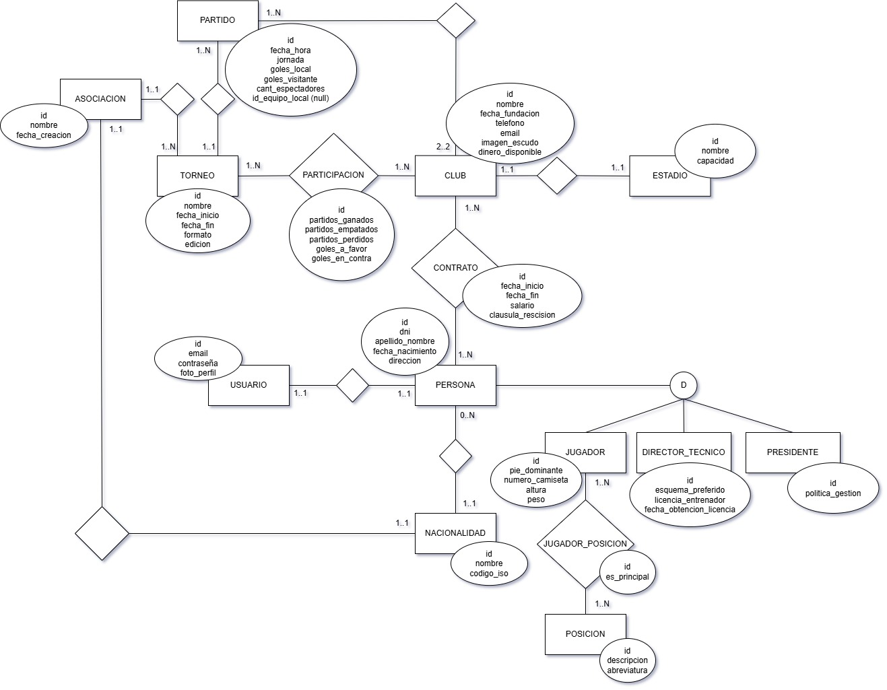

# Propuesta

## Modelo de Dominio

## Modelo de Datos

## Alcance Funcional

### Regularidad:

| Req              | Detalle                                                                                                                               |
| :--------------- | :------------------------------------------------------------------------------------------------------------------------------------ |
| CRUD simple      | 1. CRUD Persona 2. CRUD Estadio 3. CRUD Asociación                                                                              |
| CRUD dependiente | 1. CRUD Club 2. CRUD Torneo                                                                                                        |
| Listados         | 1. Listado de Jugadores con sus respectivos Clubes actuales (permitiendo filtrar por Club)                                            |
| CUU/Epic         | 1. Contrato de Jugadores y Director Técnico por parte de un Club 2. Rescisión de Contrato por parte del Jugador o Director Técnico |

### Adicionales para Aprobación

| Req                  | Detalle                                                                                                                                                                                                                                                                                                                                                                                                       |
| :------------------- | :------------------------------------------------------------------------------------------------------------------------------------------------------------------------------------------------------------------------------------------------------------------------------------------------------------------------------------------------------------------------------------------------------------ |
| CRUD                 | 1. CRUD Persona 2. CRUD Estadio 3. CRUD Asociación 4. CRUD Club 5. CRUD Torneo 6. CRUD Nacionalidad 7. CRUD Posición 8. CRUD Posiciones de Jugadores                                                                                                                                                                                                                                     |
| Listados             | 1. Listado de clubes por los que pasó un jugador en su carrera deportiva (histórico), permitiendo filtrar por un rango de fechas 2. Listado de partidos disputados por un club junto a sus resultados, permitiendo filtrar por torneo                                                                                                                                                                      |
| CUU/Epic             | 1. Armado de jornadas de torneos, junto a los partidos que se van a disputar con su fecha y hora, y la posterior asignación de los equipos que se enfrentarán en cada uno de ellos 2. Gestión completa de partidos de un torneo, incluyendo registro de resultados, puntos, y actualización automática de estadísticas de participación (partidos ganados, empatados, perdidos, goles a favor y en contra) |
| Niveles de Acceso    | 1. Administrador 2. Presidente 3. Jugador 4. Director Técnico 5. Invitado (no necesita loguearse)                                                                                                                                                                                                                                                                                                 |
| Requerimientos Extra | 1. Manejo de archivos (imágenes) 2. Envío de emails                                                                                                                                                                                                                                                                                                                                                        |
